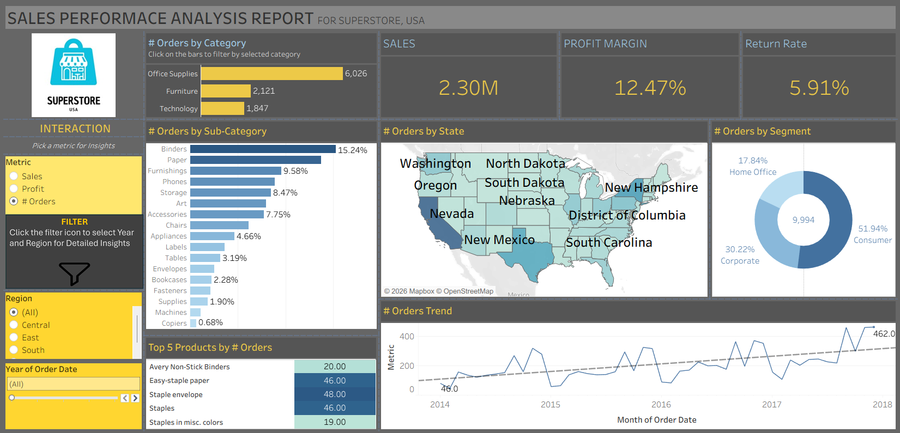
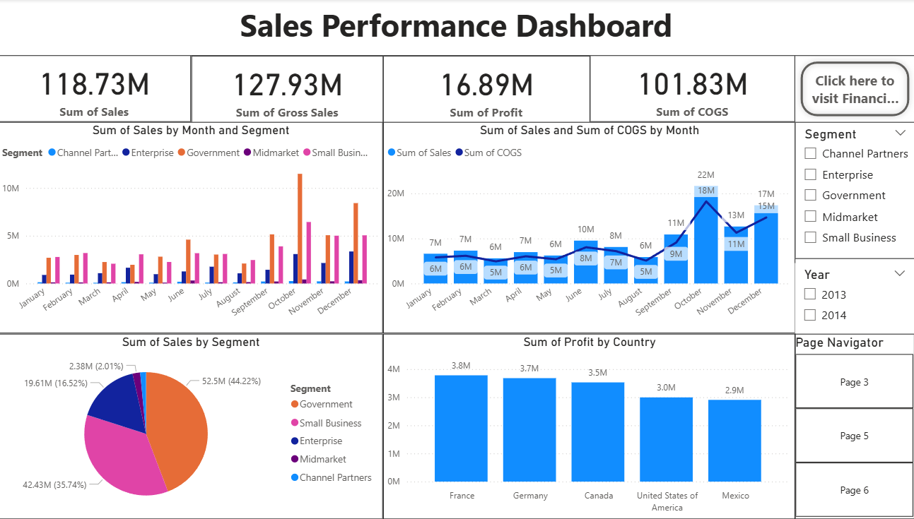
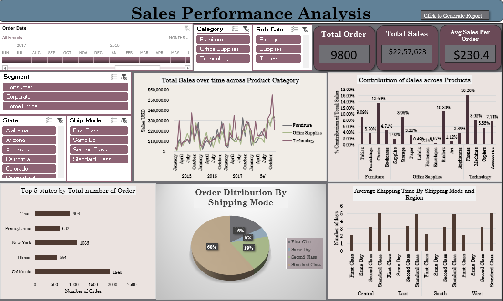

# Sales Performance & Revenue Optimization Analysis

## Project Overview
This project analyzes sales performance and revenue trends to support data-driven
business decisions. The analysis simulates enterprise-level MIS and management
reporting commonly used in corporate and consulting environments.

## Objectives
- Analyze revenue and cost performance across multiple time periods
- Identify trends, variances, and key performance drivers
- Build structured MIS-style dashboards and analytical reports
- Improve reporting accuracy and operational efficiency

## Tools & Technologies
- Power BI (Interactive dashboards, KPI tracking, DAX-based calculations)
- Tableau (Data visualization, trend analysis, comparative insights)
- Microsoft Excel (Pivot Tables, Lookups, Power Query)
- SQL (Joins, Aggregations, Subqueries)

## Dashboards & Visualizations
This project includes interactive dashboards and reports created using:
- **Power BI** for KPI monitoring, revenue trends, and management reporting
- **Tableau** for visual storytelling, comparisons, and performance insights
- **Excel** for data validation, reconciliation, and structured MIS reporting

## Key Analysis Performed
- Month-on-month and period-wise variance analysis
- Revenue vs cost performance comparison
- KPI tracking and performance monitoring
- Data validation, reconciliation, and quality checks

## Key Insights
- Identified underperforming periods and revenue fluctuations
- Highlighted key drivers impacting sales performance
- Improved reporting efficiency by approximately 12–15% (estimated)

## Power BI, Tableau & Excel Dashboard Screenshots
### Sales Performance Overview

### Revenue & Cost Analysis

### Sales Performance Analysis

## Deliverables
- SQL queries for data extraction and transformation
- Excel-based analytical and reconciliation models
- Power BI and Tableau dashboards for management and MIS reporting

## Certification
- Business Analyst & Data Analytics Certification – ExcelR  
  *Skills Covered:* Excel, Power BI, Tableau, SQL

## Author
**Chiranth K J**  
GitHub: https://github.com/Chirugow
